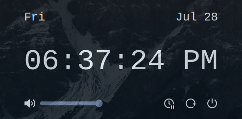

# tdash

A `Tauri` extendable dashboard using `SolidJS` and `TailwindCSS`.

Currently has:

- Date and time
- Power management buttons (Suspend, Reboot, Shutdown)
- Volume control



## Testing

```sh
pnpm tauri dev
```

## Using with i3wm

Using a hotkey keybinding in i3wm to display date/time in floating scratchpad. The idea is put components here instead of an always-present bar on top.

Add to i3 config (`~/.config/i3/config`):

```
exec --no-startup-id ~/projects/tdash/src-tauri/target/release/tdash
for_window [class="Tdash"] floating enable, sticky enable, border pixel 0, move scratchpad, move absolute position center
bindsym $mod+grave [class="Tdash"] scratchpad show, move absolute position center
```

Replace path to directory and adjust hotkey as needed.
